# UpNext

UpNext is a stack-based productivity app for deciding what to do next, not just storing a long checklist.

The app organizes recurring work into a daily stack. Mandatory tasks stay visible until completed, grouped tasks rotate after completion, subtasks break larger work into smaller steps, and task playbooks keep execution notes close at hand. UpNext also tracks one-off action items, scheduled commitments, task history, task timer sessions, and time away for sleep, social plans, eating, and other non-task life needs. The dashboard brings those signals together so the app can show both progress and the real amount of flexible time available in a day.

## Features

- Email and password sign up / login
- Daily task stack for the signed-in user
- Mandatory tasks that stay prioritized until completed
- Task groups for rotating recurring work
- Task timers that start focused work sessions from task cards
- Continue tracking time on a completed task without undoing completion
- Subtasks that can be completed independently and move down the task card
- Task playbooks for tips, steps, mindset cues, and mistakes to avoid
- Large editable playbook modal available from task cards and task management
- Highlighted Today playbook buttons when a task already has playbook notes
- Topics page for reusable notes, reminders, current focus areas, and general playbooks
- Full-page topic editor for long-form notes
- One-off action items for async errands or tasks outside the recurring stack
- Scheduled commitments for events, appointments, errands, recurring obligations, and time-based plans
- Weekly recurring commitments that can repeat on one day, weekdays, every day, or any selected set of days
- Daily Review checks for next-day self-audits like calorie limits, sleep, spending, and nutrition goals
- Complete Day flow for starting tomorrow's stack early without marking unfinished tasks complete
- Dashboard with completion trends, task-time totals, downtime charts, scheduled load, daily review results, action item status, and playbook coverage
- Completed Today section with same-day undo
- Continue button for completed tasks that need additional focused time
- History page for browsing completed tasks by day
- Daily review results stored against the day being reviewed, not the day the answer was entered
- Recent completed-day shortcuts with app-day aggregation
- Eastern-time app day handling for daily rollover
- Task completion history stored for analytics
- Downtime timer for sleep, social, eating, and other time
- Downtime sessions continue running after leaving the page
- Active downtime sessions split cleanly at Eastern midnight
- Tools section with a persistent scratch counter
- Demo seed script for local screenshots and realistic QA data
- Public About page and public landing links
- Responsive mobile navigation with a side menu
- Soft deletes for tasks and groups
- CI checks for linting, types, tests, unused code, and production build

## How It Works

UpNext treats productivity as a stack instead of a flat list.

Mandatory tasks appear first because they are expected every day. Non-mandatory tasks can belong to groups, such as Career, Health, or Study. When a grouped task is completed, it moves into Completed Today and returns the next day at the bottom of its group stack.

Example:

```text
Career stack
1. Work on portfolio project
2. Complete a LeetCode question
3. Apply to jobs
```

After completing `Work on portfolio project`, tomorrow's stack becomes:

```text
Career stack
1. Complete a LeetCode question
2. Apply to jobs
3. Work on portfolio project
```

This makes repeated work harder to avoid and helps rotate attention across important areas.

## Task Timers and Subtasks

Tasks can be timed directly from the Today page. Pressing Start begins a focused task session and pauses the default Other time-away timer. Pressing Complete stops the task session, records the task as completed for the current app day, and returns time tracking to Other.

Completed tasks can still be continued. If a task like `Read` is completed after 30 minutes, the user can press Continue later, read for another 30 minutes, and then press Stop. The task remains completed, but the dashboard records one hour of task time because both sessions belong to the same task.

Tasks can also have subtasks. Subtasks are useful for breaking the task into smaller steps, such as:

```text
Portfolio project
- Pick issue
- Implement slice
- Run tests
- Write notes
```

Subtasks can be checked off one by one and move toward the bottom of the task card. Completing every subtask is not required before completing the parent task, which keeps the workflow flexible for real days.

## Task Playbooks

Task descriptions stay short and card-facing. Playbooks are separate notes for how to perform a task well.

For example, a task like `Interview` might have a brief description:

```text
Interview Reminders.
```

And a playbook:

```text
- Sit up straight
- Use Star format when answering questions
- Ask interviewer questions
- Keep answers concise and positive
```

Playbooks can be added or edited from the Tasks page. Task cards show a Playbook button that opens the notes in a large modal without navigating away from the current page. On Today, task Playbook buttons are highlighted when notes already exist, making tasks with execution guidance easier to spot. Task playbooks can also be edited and saved directly from that modal on Today, so useful notes can be improved at the moment they are needed.

## Starting Tomorrow Early

The Today page includes a Complete Day flow for unusual schedules. If a user wakes up late in the evening and wants to treat the next calendar day as active, they can confirm the action and start tomorrow's stack early.

This does not complete unfinished tasks. It only changes the user's effective app day to tomorrow until real Eastern midnight arrives. The action is limited to one day ahead, so repeated clicks cannot jump multiple days forward.

## Completion History

The History page lets users review completed tasks by day. It includes:

- Previous Day and Next Day navigation
- A Today shortcut
- Recent completed-day shortcuts
- Sorted completed task cards for the selected day
- App-day aggregation for older completion timestamps
- Daily Review results for the selected day

History uses the same Eastern-time app-day logic as Today, so task completions are grouped by the day the app considers active rather than by the server's raw UTC date.

## Daily Review Checks

Daily Review checks are for outcomes that can only be answered honestly after the day is over. They are different from tasks because the user does not start or complete them during the day.

Examples:

```text
Was below calorie limit?
Hit protein target?
No late-night snacking?
No unnecessary spending?
Got 7+ hours of sleep?
```

On the next app day, UpNext can prompt the user to review yesterday with Yes, No, Skip, or Not sure. Results are stored against the reviewed day, so answering on June 20 records the result for June 19.

Daily checks can be created, edited, or removed from the Tasks page. The review prompt appears on Today, results appear in History, and aggregate success rates appear on the Dashboard.

## Action Items and Commitments

Recurring improvement work belongs in the daily task stack. One-off async work belongs in Action Items. Time-based obligations belong in Commitments.

Action Items are for tasks that need to happen once but do not require a specific time, such as:

```text
Return package
Call pharmacy
Submit reimbursement form
```

They can include an optional due date, description, and playbook. Open action items appear on Today when they are unscheduled, due today, or overdue.

Commitments are for scheduled or date-based obligations, such as:

```text
Dentist appointment
Work function
Interview
Grocery pickup
Go to church every Sunday at 11 AM
```

They can include a date, optional start and end time, location, description, and playbook. Commitments can also repeat weekly on one or more selected days. For example, a recurring `Go to church` commitment can appear in Today every Sunday, while a `Team standup` can repeat Monday-Friday and an `Evening shutdown` can repeat every day until the series is changed or canceled.

Recurring commitment completions are stored per occurrence, so completing this Sunday's event does not complete the whole series.

## Topics

Topics are reusable notes that do not belong to one specific task. They can hold general playbooks, reminders, current projects, principles, or reference notes.

Examples:

```text
Networking events
Interview mindset
Current projects
Nutrition rules
Sunday reset
```

Topics can be categorized, edited, archived, and restored. The Topics index stays compact with clickable rows, while each topic opens into a full-page editor with a large notes surface for longer reusable playbooks or reference material. Topics are separate from task playbooks today, but they are designed so future task-topic badges can connect reusable topic notes to specific tasks.

## Tools

The Tools section currently includes a persistent scratch counter. It is intentionally lightweight: the count is stored locally in the browser, survives navigation and app restarts, and stays there until Reset is pressed.

## Downtime Tracking

The Time page tracks time spent away from improvement activities. A user can switch the active time-away timer between:

- Sleep
- Social
- Eating
- Other

The timer keeps running if the user navigates away. When a task timer starts, active downtime stops. When task time stops, Other time starts again by default. If an active timer crosses the app-day boundary, UpNext closes the previous day's session at Eastern midnight and starts a new session for the new day.

This data is intended for future analytics around available free time, routines, and opportunities to adjust how time is spent.

## Analytics Dashboard

The Dashboard page summarizes recent app activity across the last 14 app days. It includes:

- Task completion rate
- Daily completion trend
- Focused task time by task
- Completion breakdown by task area or group
- Downtime logged by day and category
- Scheduled commitment load
- Action item open, overdue, completed, and canceled counts
- Daily Review success rate and per-check outcome totals
- Playbook coverage across tasks, action items, and commitments
- Most completed tasks

The dashboard uses existing database records rather than separate analytics tables, so it updates as tasks are completed, downtime sessions are logged, action items are resolved, and commitments are created or completed.

## Tech Stack

- Next.js 16 App Router
- React 19
- TypeScript
- Tailwind CSS
- Prisma
- PostgreSQL
- NextAuth
- Vitest
- Testing Library
- Vercel-ready build

## Data Models

- `User` stores account data.
- `TaskGroup` stores related task groups.
- `Task` stores recurring tasks, mandatory status, group membership, stack order, and optional playbook notes.
- `TaskCompletion` stores per-day task completion history.
- `TaskSession` stores focused task timer sessions for task-time analytics.
- `TaskSubtask` stores active subtasks for recurring tasks.
- `SubtaskCompletion` stores per-day subtask completion history.
- `DowntimeSession` stores timed sleep, social, eating, and other sessions.
- `ActionItem` stores one-off async tasks with optional due dates, completion status, cancellation status, and playbook notes.
- `Topic` stores reusable notes, reminders, current focus areas, and general playbooks.
- `Commitment` stores date-based, time-based, and weekly recurring obligations with optional location, start/end times, completion status, cancellation status, and playbook notes.
- `CommitmentOccurrenceCompletion` stores per-day completions for recurring commitment instances.
- `DailyCheck` stores active next-day outcome prompts for a user.
- `DailyCheckResult` stores Yes, No, Skip, or Not sure answers against the reviewed app day.
- `DailyReviewDismissal` stores when a user dismisses a day's review prompt.
- `DayStartOverride` stores a temporary per-user effective-day override for starting tomorrow early.

## Getting Started

Install dependencies:

```bash
npm install
```

Create an environment file:

```bash
cp .env.example .env
```

If `.env.example` is not present yet, create `.env` with:

```bash
DATABASE_URL="postgresql://..."
NEXTAUTH_SECRET="replace-me"
NEXTAUTH_URL="http://localhost:3000"
```

Apply database migrations:

```bash
npx prisma migrate dev
```

Start the development server:

```bash
npm run dev
```

Open:

```text
http://localhost:3000
```

## Demo Data

For local screenshots, demos, and manual QA, seed a demo account:

```bash
npm run seed:demo
```

Then log in with:

```text
Email: demo@upnext.dev
Password: demo-password
```

The demo seed deletes and recreates only `demo@upnext.dev`. It does not touch other users. The script refuses to run with `NODE_ENV=production` unless `ALLOW_DEMO_SEED_PRODUCTION=true` is explicitly set.

The seed includes realistic coverage for screenshots and QA:

- 12 recurring tasks across Health, Career, Life Admin, and Social groups
- Mandatory tasks, rotating grouped tasks, task playbooks, and subtasks
- 21 days of task completions, task sessions, subtask completions, and downtime sessions
- Action items with open, overdue, completed, and canceled states
- One-time, single-day weekly, weekday, and every-day recurring commitments with occurrence completions
- Daily Review checks and historical Yes/No/Skip/Unsure results
- Long-form Topics for the full-page topic editor

## Quality Checks

Run the full local check set:

```bash
npm run lint
npm run typecheck
npm run unused
npm run test:run
npm run build
```

For test watch mode:

```bash
npm test
```

## Database Migrations

Local development uses:

```bash
npx prisma migrate dev
```

Production deployments should use:

```bash
npx prisma migrate deploy
```

Do not use `prisma migrate dev` in production.

## GitHub Actions

The CI workflow runs on pull requests and pushes to `main`. It installs dependencies, then runs:

- ESLint
- TypeScript typecheck
- Knip unused-code check
- Vitest test suite
- Production build

## Roadmap

- Weekly and monthly summaries
- Streak tracking
- Most skipped or neglected task insights
- More detailed available-time estimates
- Drag-and-drop task ordering
- Skip reasons
- Notifications and reminders
- Richer playbook formatting or reusable playbook templates

## Screenshots

### Today's Stack

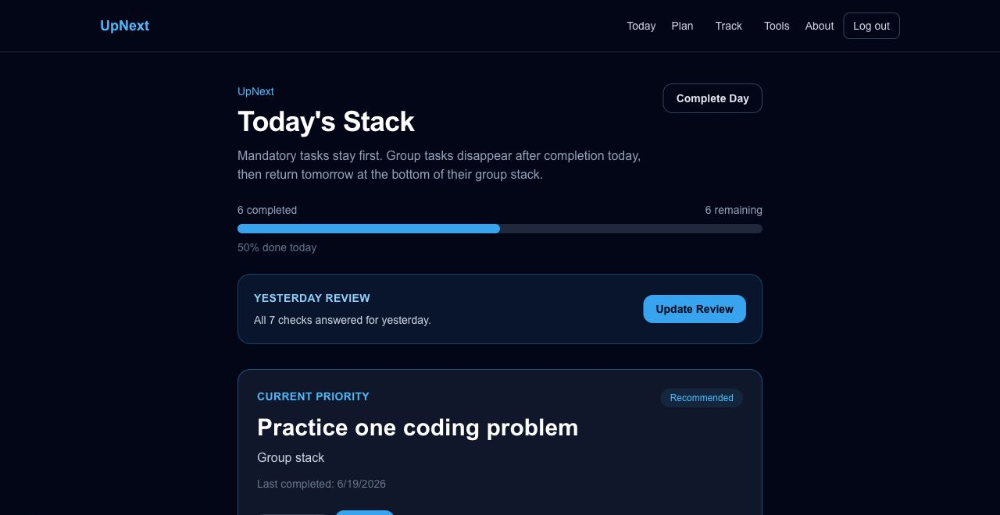

### Analytics Dashboard

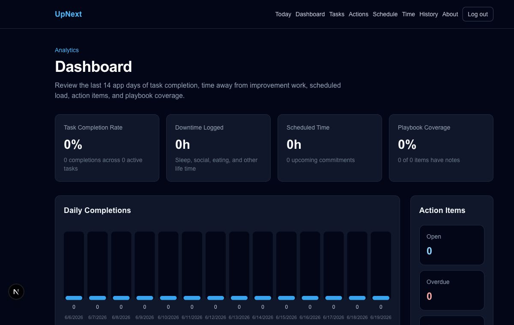

### Task Management

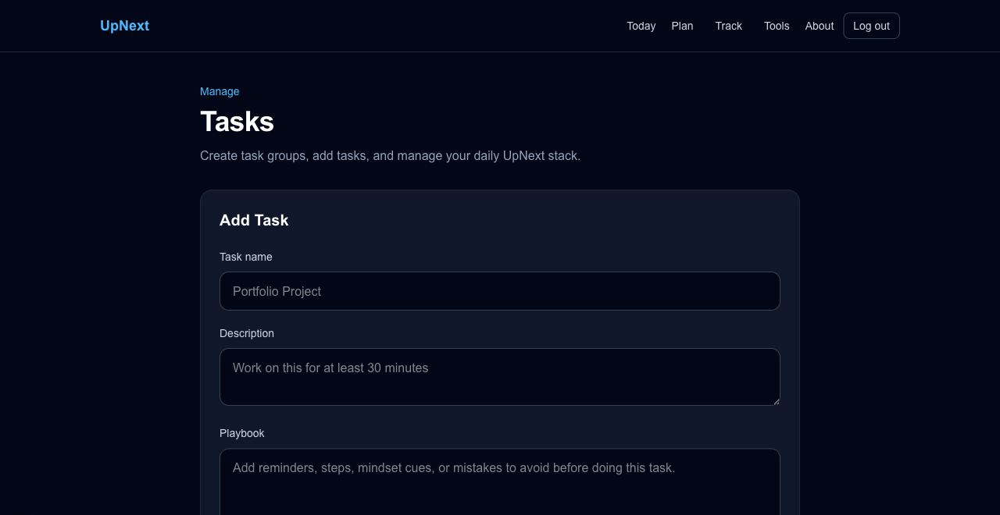

### Editable Playbook Modal

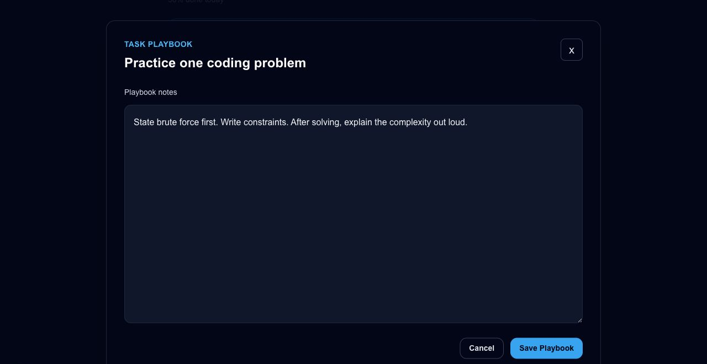

### Action Items

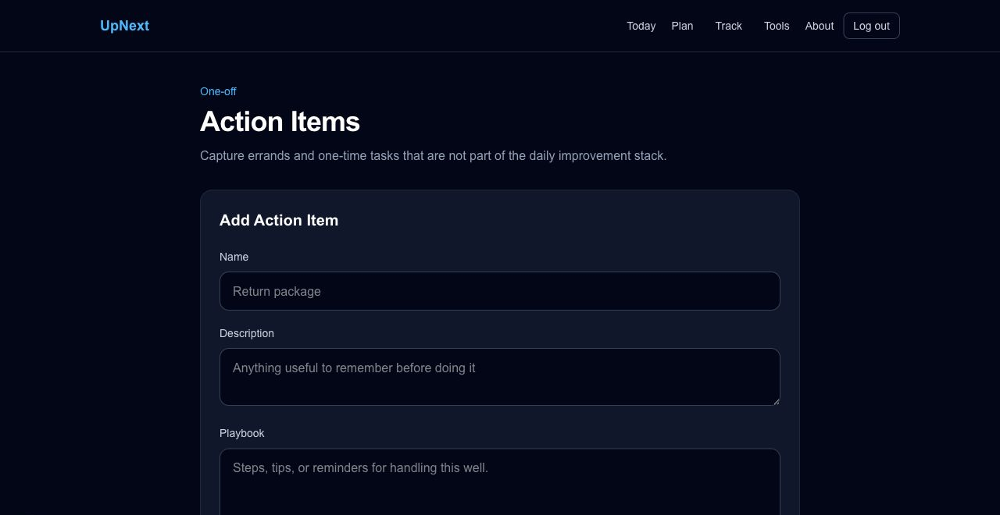

### Schedule and Commitments

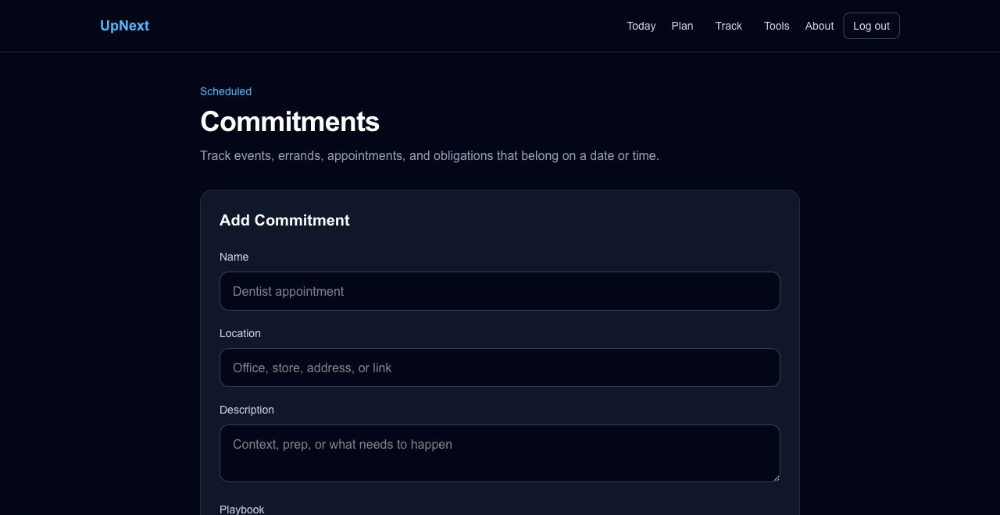

### Time Away Tracking

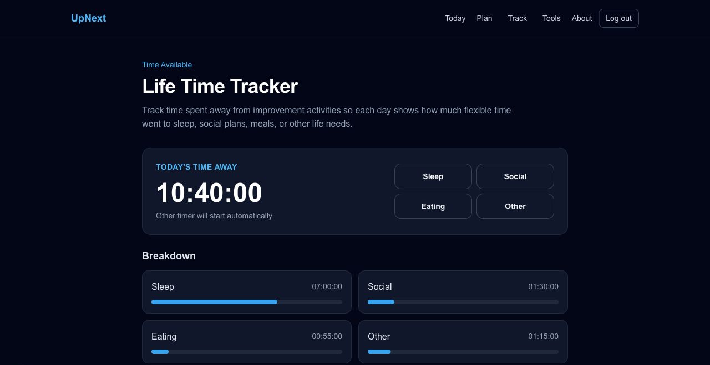

### Completion History

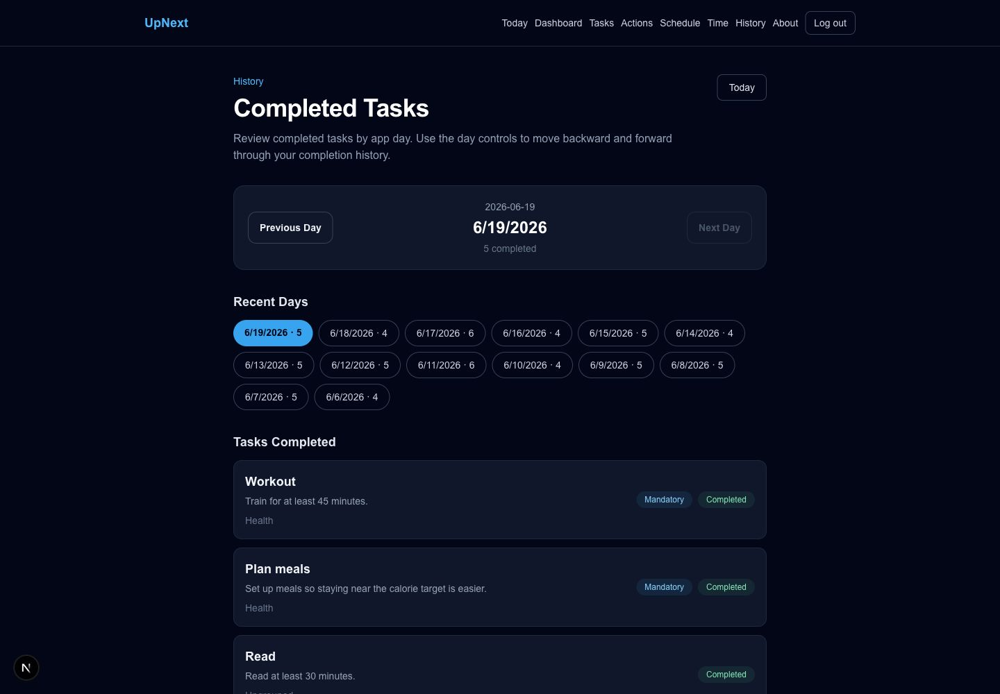

### Topics

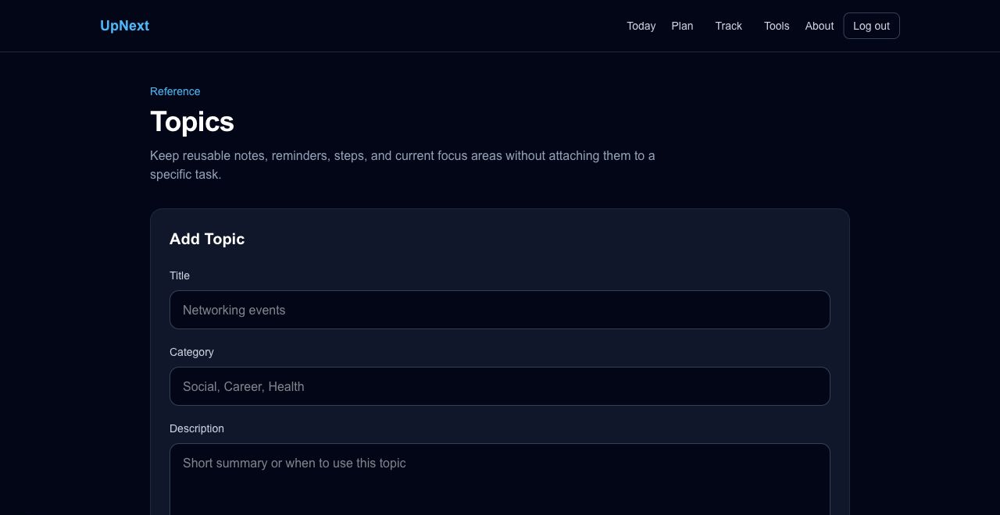

### Full-Page Topic Editor

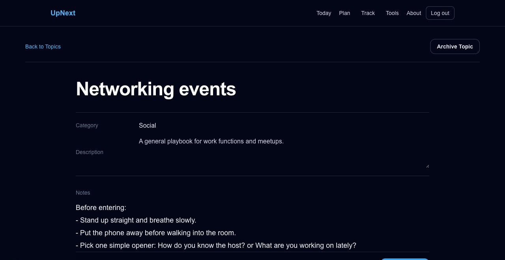

### Persistent Counter Tool

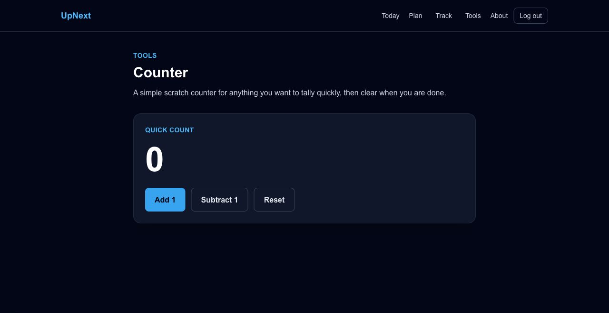
